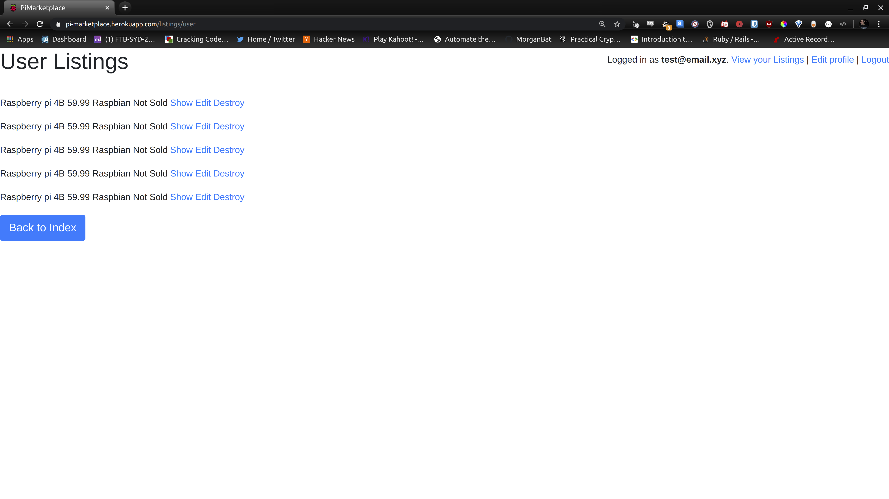

# Morgan Batterham - T2A2

## Raspberry Pi Marketplace - Two Way Marketplace built on Ruby on Rails

Available live at https://pi-marketplace.herokuapp.com

Github repo - https://github.com/MorganBat/pi-marketplace

### R7 - Identification of the problem you are trying to solve by building this particular marketplace app.

Raspberry Pis are an incredibly popular micro computer used for a wide array of projects. There is a variety of models available with different hardware configurations and capabilities. Additionally, a wide variety of software can be installed.

### R8 - Why is it a problem that needs solving?

There are two main problems being solved here:

1. People may have Raspberry Pis they are no longer using, so they may wish to sell them. At the other end is people who are happy to buy a second hand raspberry pi, especially if an older model has a certain plug (HDMI, micro-usb etc.) which has been phased out of the newer models.

2. Some software can be quite difficult to setup. Some users may not have the knowledge required to install and setup a certain package, or may be time poor and willing to pay for a raspberry pi with pre installed software.

### R11 - Description of your marketplace app

#### Purpose:
The purpose of this website is to facilitate the trade of second hand Raspberry Pis between sellers and buyers. In some cases the Raspberry pi may come with pre installed software.

#### Functionality/Features:
**Accounts:**
The first step to use the website is to register a user account. Pi Marketplace doesn't differentiate between Buyer and Seller accounts, the same account can be used for both. Once an account is registered and verified then the user can list a Raspberry pi for Sale, or purchase a Raspberry Pi listed on the site. 

Accounts are handled by the ```devise``` gem.
Payments are handled by the ```stripe``` gem.

**Listings:**
The main page of the website lists all of the Raspberry Pis currently for sale. From here a user can create a new listing, edit or delete their own listings, or go through to view more information about any listing.

When the user clicks through to access more information (including a photo) they will have the option to purchase the Raspberry pi, with payment being handled by Stripe.

**Stripe Integration:**
If the user is on a listing page that was not created by them, they have the option to purchase the Raspberry pi. Payments are handled by Stripe, and upon successful completion of the transaction that are returned back to the website.

#### Sitemap


#### Screenshots




#### Target Audience
The main target audience is Electronics Hobbyists. This website is not designed solely for selling secondhand hardware, but also selling hardware with different preinstalled software.

#### Tech Stack

**Front End:** HTML, CSS, Embedded Ruby, Bootstrap, Javascript

**Back End:** Ruby, Ruby on Rails

**Additional Gems:** Devise, Stripe, AWS S3, Ultrahook, Faker, Ransack

**Database:** PostgreSQL

**Deployment:** Heroku

**Version Control:** Git, GitHub

### R12 - User Stories

1. As a seller, I wish to be able to sell old Raspberry pis that I am no longer using.

2. As a seller, I wish to be able to sell raspberry pis with different software installed as a value add.

3. As a buyer, I wish to be able to buy second hand Raspberry Pis as they will be cheaper.

4. As a buyer, I may wish to purchase a Raspberry pi with pre installed software to save myself time or because I lack the technical skills to configure the pi.

### R13 - Wireframes

### R14 - Entity Relationship Diagram


### R15 - Explain the different high-level components (abstractions) in your app

Pi Marketplace is built on Ruby on Rails, a web framework which utilises the Model/View/Controller (MVC) architecture. Pi Marketplace also utilises a relational database for long term storage of data.

**Database:** The Database (PostgreSQL is used in this instance) is used for the long term storage of data, allowing the data to persist between sessions.

**Model:** The model handles the interface with the Database. It also organises the relationships between the various database tables, such as linking the listing to the user account that created it. Also deletes all a user's listings if a user account is deleted, through setting the ```dependent: :destroy```.

**Controller:** The controller is the interface between the model and the view. The controller passes information between them as required, and contains the majority of the logic used in the app. The controller is used to authenticate the user.

**View:** The view is what's displayed to the end user. It uses HTML, CSS and Embedded Ruby to display information provided by the controller.


### R16 - Detail any third party services that your app will use

**Heroku:** Heroku is a cloud hosting provider designed specifically for the hosting of web apps. It allows a user to deploy their Rails app through a Command Line Interface which utilises Git commands to upload the source files.

**AWS S3:** AWS (Amazon Web Services) S3 (Simple Storage Service) is a cloud hosting web platform. In this app I have used a S3 bucket to host user uploaded images. This uses the ```aws-s3``` gem. Credentials are stored in ```config/credentials.ymc.enc``` which is decrypted by the master key stored in ```config/master.key```

**Stripe:** Stripe is an online payment processor. Uses the ```stripe``` gem. Stripe completely handles credit card payments on their website. Stripe also offers a comprehensive dashboard that tracks payment statistics such as Gross Volume, New Customers, Spend per customer and many more. It also offers a RESTful API and a Webhook service for integrating receipt handling into your web app.

**Devise:** Devise is a user authentication platform built for Ruby on Rails. Uses the ```devise``` gem. Devise handles users signing up for and logging into their profiles.

**Ransack:** Ransack is a gem used for sorting the listings on the listing page. By clicking on the headers the user can sort various parameters in either ascending or descending order, such as Name, Model, Price, Software and Description.

**Faker:** Faker is a gem used to generate fake information. In this application it is used to seed the database with 'fake' data for testing purposes.

**PostgreSQL:** PostgreSQL is a relational database management system. In this application it is used for the long term storage of user data and their associated listings.

**Ultrahook:** Ultrahook is a web based Webhook platform. In this application it is used for testing Stripe's payment webhook. Ultrahook is designed to forward webhook requests, which is very useful when running the application on a local computer for testing.

### R17 - Describe your projects models in terms of the relationships (active record associations) they have with each other
```ruby
class User < ApplicationRecord
  devise :database_authenticatable, :registerable, :recoverable, :rememberable, :validatable

  has_many :listings, dependent: :destroy
end
```

```ruby
class Listing < ApplicationRecord
    belongs_to :user

    has_one_attached :image
end
```

### R18 - Discuss the database relations to be implemented in your application


- A user ```has_many``` listings, with a ```dependent: :destroy``` relationship
- A listing ```belongs_to``` a user

A user can have zero listings, one listing or many listings. A listing can only belong to one user, and through the ```dependent: :destroy``` relationship if a user is deleted, the associated listings are deleted too. This prevents orphaned records in the database. The Foreign keys column is used to link the listings and users to each other.

### R19 - Provide your database schema design

**Active Storage Attachments:**
```ruby
  create_table "active_storage_attachments", force: :cascade do |t|
    t.string "name", null: false
    t.string "record_type", null: false
    t.bigint "record_id", null: false
    t.bigint "blob_id", null: false
    t.datetime "created_at", null: false
    t.index ["blob_id"], name: "index_active_storage_attachments_on_blob_id"
    t.index ["record_type", "record_id", "name", "blob_id"], name: "index_active_storage_attachments_uniqueness", unique: true
  end
```

**Active Storage Blobs:**
```ruby
  create_table "active_storage_blobs", force: :cascade do |t|
    t.string "key", null: false
    t.string "filename", null: false
    t.string "content_type"
    t.text "metadata"
    t.bigint "byte_size", null: false
    t.string "checksum", null: false
    t.datetime "created_at", null: false
    t.index ["key"], name: "index_active_storage_blobs_on_key", unique: true
  end
```

**Listings Table:**
```ruby 
  create_table "listings", force: :cascade do |t|
    t.string "name"
    t.string "model"
    t.float "price"
    t.text "software"
    t.text "description"
    t.datetime "created_at", null: false
    t.datetime "updated_at", null: false
    t.bigint "user_id"
    t.boolean "sold"
    t.index ["user_id"], name: "index_listings_on_user_id"
  end
```

**Users Table:**
```ruby
  create_table "users", force: :cascade do |t|
    t.string "name"
    t.string "location"
    t.datetime "created_at", null: false
    t.datetime "updated_at", null: false
    t.string "email", default: "", null: false
    t.string "encrypted_password", default: "", null: false
    t.string "reset_password_token"
    t.datetime "reset_password_sent_at"
    t.datetime "remember_created_at"
    t.index ["email"], name: "index_users_on_email", unique: true
    t.index ["reset_password_token"], name: "index_users_on_reset_password_token", unique: true
  end
```

**Foreign Keys:**
```ruby
  add_foreign_key "active_storage_attachments", "active_storage_blobs", column: "blob_id"
  add_foreign_key "listings", "users"
```

### R20 - Describe the way tasks are allocated and tracked in your project